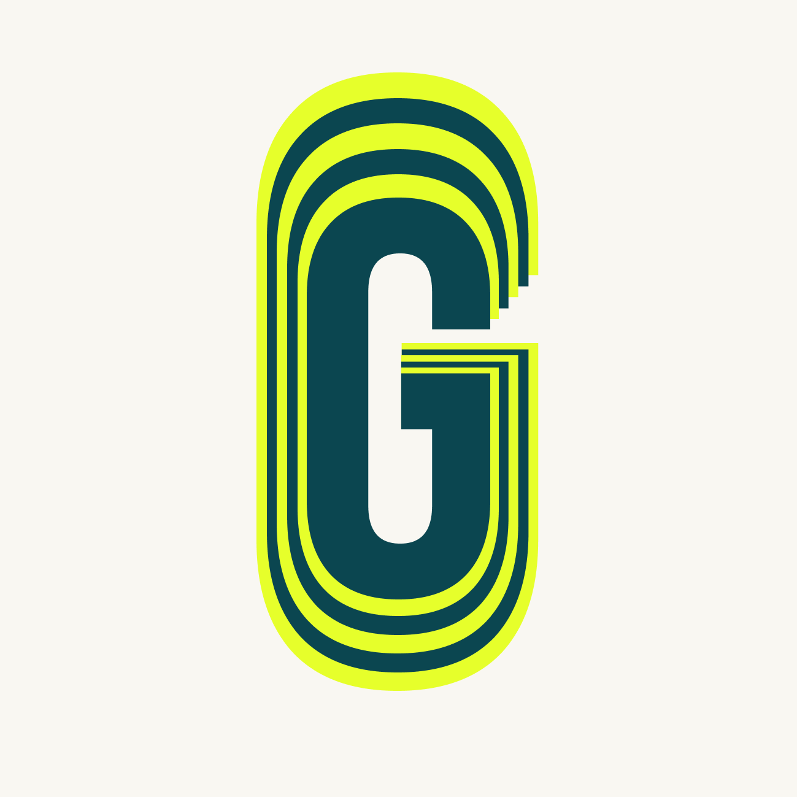

<div align="center">
   
   <h1>GymPad</h1>
   <p><em>Your unified hub for structured training, personalized programming, and tracking progress.</em></p>
</div>

---

## 🚀 Overview
GymPad is a Flutter application for tracking workouts, running structured or custom sessions, managing personalization data, and (soon) enabling social & intelligent coaching experiences. It targets **Android, iOS, and Web** using a consistent design system and a layered architecture (see below).

Current scope focuses on:
- Personalized onboarding via a multi-step questionnaire (with offline persistence + background submit retry)
- Workout session flows (free / custom / saved)
- Local-first data with Hive + API sync patterns
- Clean separation of UI, BLoC state management, services, and storage layers
- Polished interaction components (velocity-based weight selector, progress bars, animated onboarding, etc.)

---

## ✨ Key Features

### Training & Sessions
- Start free workouts or run structured/custom ones
- Track sets: weight, reps, timing, and execution flow
- In‑session controls for breaks, next exercise, and wrap-up

### Personalized Questionnaire
- Multi-screen guided questionnaire (goals, experience, constraints)
- Skippable but re-openable in “force” mode from profile
- Local persistence (Hive) + deferred upload with retry on app start
- Submit button with loading state + non-blocking network errors (UX-first)

### Velocity-Inspired Weight Selector
- Horizontal scroll-based selector using inertia
- Snaps to logical plate/weight increments
- Adaptive styling using `AppTextStyles` + high contrast for active selection
- Easily extensible for velocity tracking add‑ons

### Robust Local Storage (Hive)
- Version-safe adapters with recovery logic (box corruption fallback)
- Clear separation: domain models vs. Hive adapters
- Services own all box logic; no UI direct access

### State Management (flutter_bloc)
- One BLoC per feature (e.g., `QuestionnaireBloc`, `WorkoutBloc` etc.)
- Events drive state transitions; immutable states emitted (copyWith pattern)
- UI = passive renderer + event dispatcher

### Navigation
- GoRouter-based strongly-typed route patterns
- Guarded flows (e.g., redirect if questionnaire incomplete unless forced)

### Logging & Resilience
- Central `AppLogger` (expansion point) instead of `print`
- Non-fatal failure strategies

---

## 🧱 Architecture

Layered approach (top → bottom):
1. **Screens / Widgets** – Presentation only; minimal logic; rely on BLoC
2. **BLoC (Events + States)** – Pure state orchestration, no IO
3. **Services** – Coordinate API + local persistence + domain logic
4. **API DTOs** – Serialization layer for network boundaries
5. **Domain Models** – Internal rich types used by app logic
6. **Hive Adapters** – Storage-specific representations
7. **Utilities** – Formatting, timers, etc.

Design rules:
- UI never calls API or Hive directly
- Services are the sole orchestrators of persistence/network
- BLoC uses services only; emits new immutable states (no in-place mutations)
- Mapping (domain ↔ storage ↔ DTO) remains explicit and testable
- Navigation decisions based on BLoC states

---

## 🗂 Project Structure (Excerpt)

```
lib/
   main.dart
   firebase_options.dart
   constants/
      app_styles.dart
   blocs/
      questionnaire/
         questionnaire_bloc.dart
         questionnaire_event.dart
         questionnaire_state.dart
      workout/ ...
   models/
   services/
      api/
         api_service.dart
         models/
      hive/
         hive_initializer.dart
         adapters/
            hive_questionnaire.dart
         questionnaire_lss.dart
      questionnaire_service.dart
   screens/
      intro/
         intro_screen.dart
      questionnaire/
         questionnaire_screen.dart
      workouts/...
   widgets/
      velocity_weight_selector.dart
```

---

## 🛠 Tech Stack

| Concern            | Choice / Notes |
|--------------------|---------------|
| UI Framework       | Flutter (stable channel) |
| State Management   | `flutter_bloc` |
| Local Storage      | Hive (adapters + recovery) |
| Auth / Backend     | Firebase |
| HTTP               | Dio (inside API service) |
| Fonts / Styling    | Google Fonts (Bebas Neue, Kanit) |
| Navigation         | GoRouter |
| Logging            | AppLogger abstraction |
| Audio / Feedback   | (Pluggable service pattern) |

---

## 📥 Setup

```bash
git clone <repo-url>
cd gympad
flutter pub get
```

Run (mobile/web):
```bash
flutter run          # auto-selects a device
flutter run -d chrome
./run-web.sh         # custom web convenience script
```

Code quality:
```bash
flutter analyze
dart format .
```

If Firebase not initialized locally, ensure `firebase_options.dart` exists (already tracked) and required platform config (GoogleServices / plist) is in place.

---

## 🔄 Data & Persistence

| Layer | Responsibility |
|-------|----------------|
| Hive Local Storage Service | CRUD + resilient open (questionnaire, workouts) |
| Service Facade | Merge local + remote intent; schedule retries |
| API Service | Typed methods returning wrapper objects (success/data/message) |

Recovery snippet (conceptual): delete incompatible box on open failure → reopen empty.

---

## 🧩 Velocity Weight Selector (Highlight)

| Feature | Detail |
|---------|--------|
| Input   | Horizontal drag / fling |
| Snap    | Rounds to nearest valid increment |
| Visual  | Enlarged active weight, dim neighbors |
| Extensible | Hook in bar speed / velocity-based recommendations later |
---

Built with ❤️ for athletes, builders, and future you.
